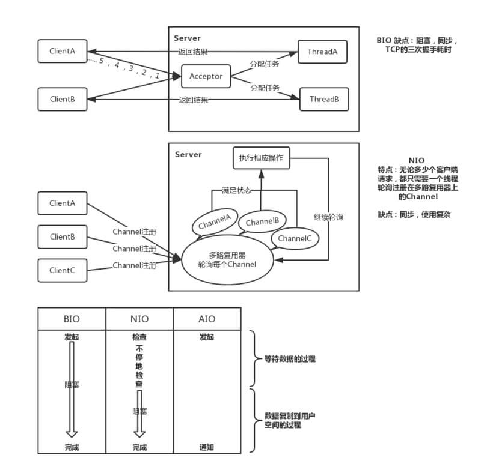

# Netty

## BIO 是什么？

BIO ，全称 Block-IO ，是一种**阻塞** + **同步**的通信模式。

- 服务器通过一个 **Acceptor** 线程，负责**监听客户端请求**和为每个客户端创建一个新的线程进行**链路**处理。典型的**一请求一应答模式**。
- 若客户端数量增多，频繁地创建和销毁线程会给服务器打开很大的压力。后改良为用**线程池的方式**代替新增线程，被称为**伪异步 IO** 。

BIO 模型中，通过 **Socket** 和 **ServerSocket** 实现套接字通道的通信。阻塞，同步，建立连接耗时。

## NIO 是什么？

NIO ，全称 New IO ，也叫 Non-Block IO ，是一种**非阻塞** + 同步的通信模式。

* 客户端和服务器之间通过 **Channel** 通信。NIO 可以**在 Channel 进行读写**操作。这些 Channel **都会被注册在 Selector** 多路复用器上。Selector 通过**一个线程**不停的轮询这些 Channel 。找出已经准备**就绪的 Channel** 执行 IO 操作。

* NIO **通过一个线程轮询，实现千万个客户端的请求**，这就是非阻塞 NIO 的特点。
  * 缓冲区 **Buffer** ：它是 NIO 与 BIO 的一个重要区别。
    * BIO 是将数据直接**写入或读取**到流 **Stream** 对象中。
    * **NIO 的数据操作都是在 Buffer 中进行的**。Buffer 实际上是一个**数组**。Buffer 最常见的类型是ByteBuffer，另外还有 CharBuffer，ShortBuffer，IntBuffer，LongBuffer，FloatBuffer，DoubleBuffer。

* 通道 **Channel** ：和流 Stream 不同，**通道是双向的**。NIO可以通过 Channel 进行数据的读、写和**同时读写**操作。
  * 通道分为两大类：一类是**网络读写**（SelectableChannel），一类是用于**文件操作**（FileChannel）。我们使用的是前者 **SocketChannel** 和 **ServerSocketChannel** ，都是 **SelectableChannel** 的子类。

* 多路复用器 **Selector** ：NIO 编程的基础。多路复用器提供**选择已经就绪的任务**的能力：就是 Selector 会不断地**轮询**注册在其上的**通道**（Channel），如果某个通道处于**就绪**状态，会被 Selector 轮询出来，然后**通过 SelectionKey 可以取得就绪的Channel集合**，从而进行后续的 IO 操作。

**总结**：NIO 模型中通过 **SocketChannel** 和 **ServerSocketChannel** 实现**套接字通道**的通信。非阻塞，同步，避免为**每个 TCP** 连接创建一个线程。

**注意**：

*  Java NIO 是**同步** IO ，Java AIO ( 也称为 NIO 2 )是**异步** IO。

在 **Unix IO 模型**的语境下：

- 同步和异步的区别：数据拷贝阶段是否需要完全由操作系统处理。
- 阻塞和非阻塞操作：是针对发起 IO 请求操作后，是否有**立刻**返回一个**标志信息**而**不让请求线程等待**。

因此，Java NIO 是**同步**且**非阻塞**的 IO 。

## AIO 是什么？

* AIO ，全称 Asynchronous IO ，也叫 NIO**2** ，是一种**非阻塞** + **异步**的通信模式。在 NIO 的基础上，**引入了新的异步通道的概念**，并提供了**异步文件通道**和**异步套接字通道**的实现。

* AIO 并没有采用 NIO 的**多路复用器**，而是使用**异步通道**的概念。其 read，write 方法的返回类型，都是 **Future** 对象。而 **Future** 模型是**异步的**，其核心思想是：**去主函数等待时间**。

AIO 模型中通过 **AsynchronousSocketChannel** 和 **AsynchronousServerSocketChannel** 实现**套接字通道**的通信。**非阻塞**，**异步**。

## BIO、NIO 有什么区别？

- 线程模型不同
  - BIO：**一个连接一个线程**，客户端有连接请求时服务器端就需要启动一个线程进行处理。所以，线程开销大。可改良为用线程池的方式代替新创建线程，被称为伪异步 IO 。
  - NIO：**一个请求一个线程**，但客户端发送的连接请求**都会注册到多路复用器上**，多路复用器轮询到**连接有新的 I/O 请求**时，**才启动一个线程进行处理**。可改良为一个线程处理多个请求，基于 [多 Reactor 模型](http://svip.iocoder.cn/Netty/EventLoop-1-Reactor-Model/)。
- BIO 是**面向流( Stream )**的，而 NIO 是**面向缓冲区( Buffer )**的。
- BIO 的各种操作是**阻塞**的，而 NIO 的各种操作是**非阻塞**的。
- **BIO 的 Socket** 是单向的，而 **NIO 的 Channel** 是**双向**的。

## Netty

搭建一个 Server 服务器，使用 **Java NIO 的步骤**如下：

1. 创建 ServerSocketChannel 。
   - 绑定监听端口，并配置为**非阻塞**模式。
2. 创建 Selector，将之前创建的 ServerSocketChannel 注册到 Selector 上，监听 **SelectionKey.OP_ACCEPT**。
   - 循环执行 `Selector#select()` 方法，**轮询就绪的 Channel**。
3. 轮询就绪的 Channel 时，如果是处于  **OP_ACCEPT** 状态，说明是新的客户端接入，调用 **ServerSocketChannel#accept()**  方法，接收新的客户端。
   - 设置新接入的 SocketChannel 为**非阻塞模式**，**并注册到 Selector 上**，监听 **`OP_READ`** 。
4. 如果轮询的 Channel 状态是 **OP_READ**，说明有新的就绪数据包需要读取，则构造 **ByteBuffer** 对象，读取数据。
   - 这里，解码数据包的过程，需要我们自己编写。

使用 **Netty 的步骤**如下：

1. 创建 NIO 线程组 **EventLoopGroup** 和 **ServerBootstrap**。
   - 设置 **ServerBootstrap** 的属性：线程组、**SO_BACKLOG** 选项，设置 **NioServerSocketChannel** 为 Channel
   - 设置业务处理 Handler 和 编解码器 Codec 。
   - 绑定端口，启动服务器程序。
2. 在业务处理 Handler 中，**处理客户端发送的数据**，并给出响应。

相比 Java NIO，使用 Netty 开发程序，都**简化了哪些步骤**呢？

1. 无需关心 `OP_ACCEPT`、`OP_READ`、`OP_WRITE` 等等 **IO 操作**，Netty 已经封装，对我们在使用是透明无感的。
2. 使用 boss 和 worker EventLoopGroup ，Netty 直接提供**多 Reactor 多线程模型**。
3. 在 Netty 中，我们看到有使用一个**解码器 FixedLengthFrameDecoder**，可以用于**处理定长消息的问题**，能够解决 **TCP 粘包拆包**问题，十分方便。如果使用 Java NIO ，需要我们自行实现解码器。